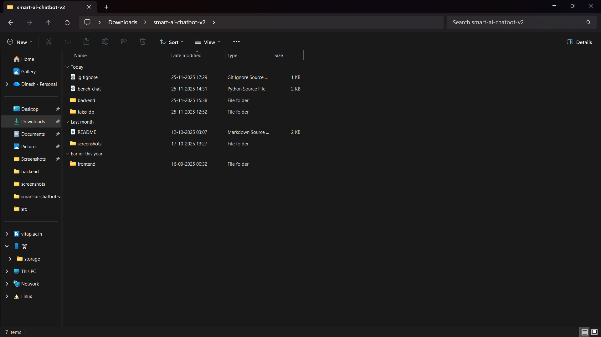
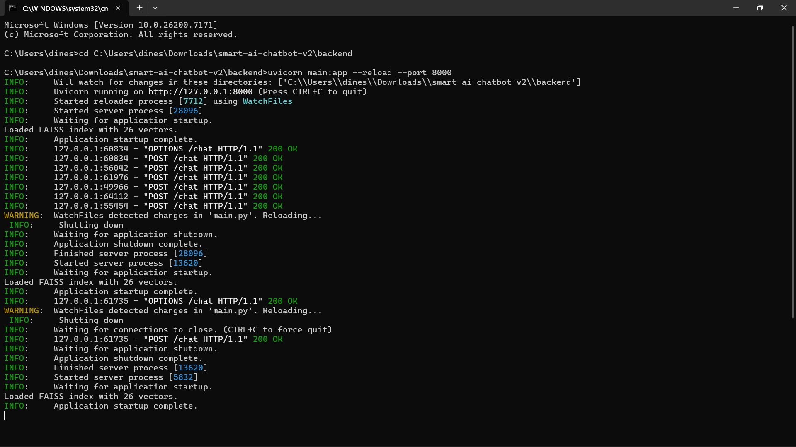
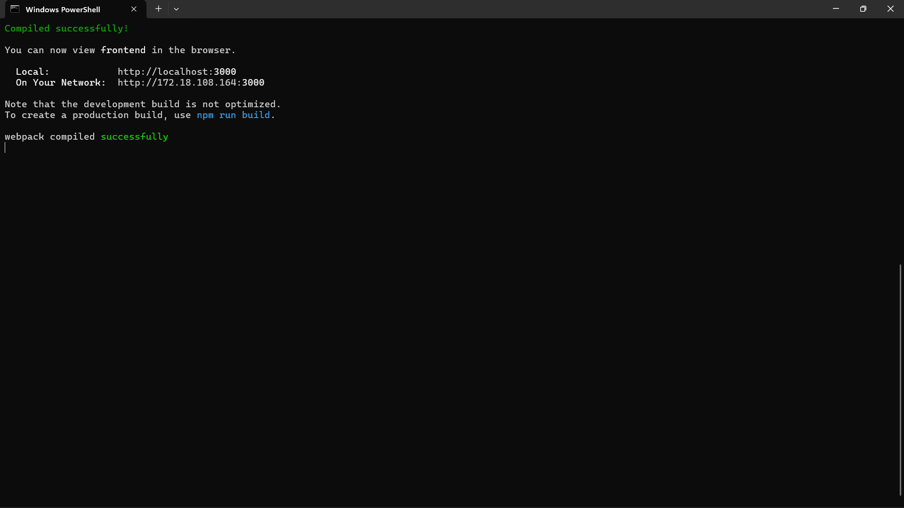
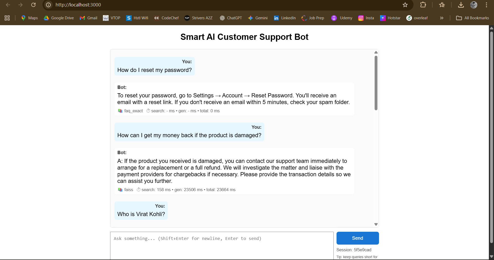

# 🤖 Smart AI Customer Support Chatbot

A full-stack AI customer support chatbot built using FastAPI, React, and Llama 2 (via Ollama).  
It uses RAG (Retrieval-Augmented Generation) with FAISS to retrieve relevant FAQ answers and generate context-aware responses.

---

## 🚀 Features
• Intelligent chatbot powered by Llama 2  
• RAG-based answer retrieval from faq.txt  
• FAISS semantic vector search  
• Session-aware memory for conversations  
• Automatic escalation for negative or urgent messages  
• Full-stack web app — FastAPI + React  
• Local vector store inside backend/faiss_db/

---

## 🏗 Project Structure

| Folder | Purpose |
|--------|---------|
| backend/ | FastAPI server, inference logic, FAISS index |
| frontend/ | React chat UI |
| bench_chat.py | Prompt benchmarking |
| faiss_db/ | Vector database generated from FAQ |
| screenshots/ | UI demonstration images |

📌 Screenshot:  

---

## ⚙️ Setup Instructions

🔹 1️⃣ Clone the Repository  
git clone https://github.com/dinesh-07-27/smart-ai-chatbot-v2.git  
cd smart-ai-chatbot-v2

---

🔹 2️⃣ Backend Setup (FastAPI + FAISS + Ollama)  
cd backend  
python -m venv venv  
venv\Scripts\activate   (Windows)  
pip install -r requirements.txt  
python ingest.py        (builds FAISS index)  
uvicorn main:app --reload --port 8000

Backend will run at: http://127.0.0.1:8000  

📌 Screenshot:  

---

🔹 3️⃣ Frontend Setup (React)  
cd ../frontend  
npm install  
npm start

Frontend will run at: http://localhost:3000  

📌 Screenshot:  

---

## 🧩 Live Chat Demo
📌 Screenshot:  

---

## 📚 FAQ Retrieval Example
📌 Screenshot:  

---

## 🎥 Demo Video
🔗 Full demo video:  
https://drive.google.com/file/d/1xMzJXdvkgMUPZNjrQ9M8wWF4Cad2fuJZ/view?usp=sharing

---

## 🔮 Future Improvements
• Authentication with user chat history  
• RAG expansion to PDFs and websites  
• Deployment using Docker on Railway / Render  
• Admin panel to manage FAQs in realtime

---

## 🙌 Credits
Built with: FastAPI, React, FAISS, Ollama (Llama 2), Python & JavaScript  
Developed with ❤️ for seamless AI-powered customer support
