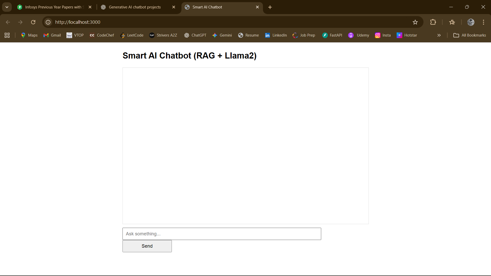
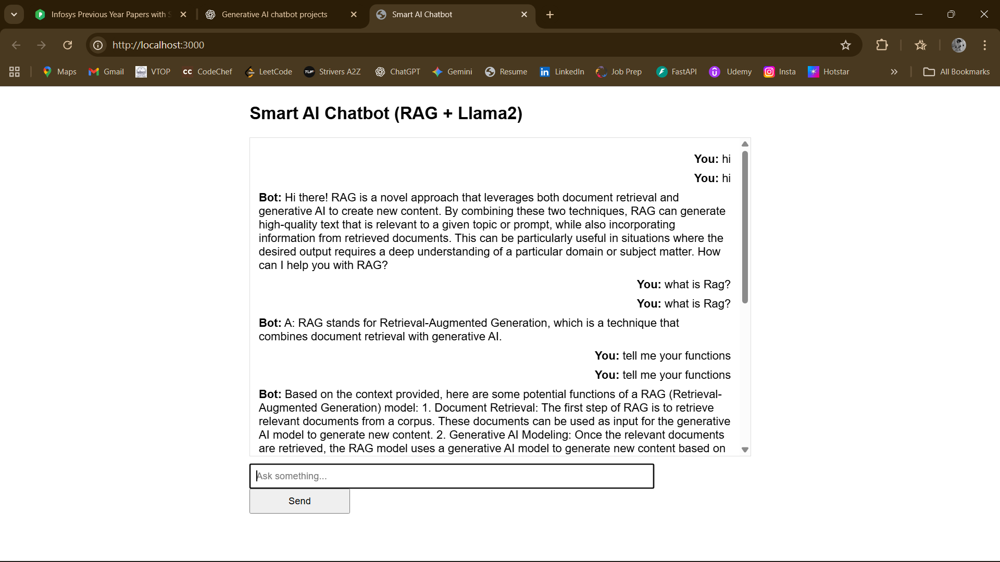
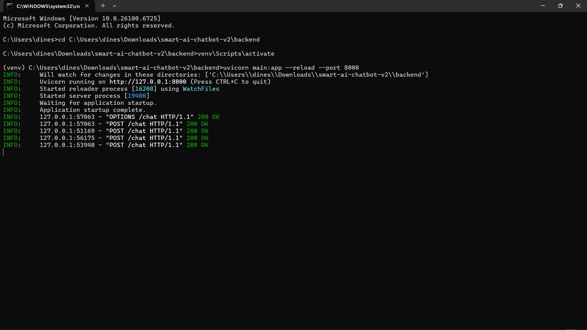

# 🤖 Smart AI Customer Support Chatbot

A **full-stack AI-powered chatbot** built with **FastAPI**, **React**, and **Llama2 (via Ollama)**.  
It uses **RAG (Retrieval-Augmented Generation)** to fetch answers from a FAQ knowledge base and deliver context-aware responses.

---

## 🚀 Key Features
- AI-powered conversational responses using **Llama2**
- **RAG-powered FAQ retrieval** from `faq.txt`
- **FastAPI backend** with `/chat` API endpoint
- **React frontend** with real-time chat UI
- **SQLite + ChromaDB** for chat history and embeddings
- Easy to extend with PDFs, docs, or web sources

---

## 🛠 Tech Stack
- **Backend**: FastAPI (Python)
- **Frontend**: React (JavaScript)
- **Vector DB**: ChromaDB
- **Database**: SQLite
- **AI Model**: Llama2 via [Ollama](https://ollama.ai)

---

## ⚡ Run Locally

```bash
# 1️⃣ Clone the repo
git clone https://github.com/dinesh-07-27/smart-ai-chatbot.git
cd smart-ai-chatbot

# 2️⃣ Backend
cd backend
python -m venv venv
venv\Scripts\activate       # Windows
pip install -r requirements.txt
python ingest.py            # Load FAQ into ChromaDB
uvicorn main:app --reload --port 8000

# 3️⃣ Frontend
cd ../frontend
npm install
npm start

# 4️⃣ Open in browser
http://localhost:3000

## Screenshots

### Chat UI


### Bot Answering


### Backend Running


---
